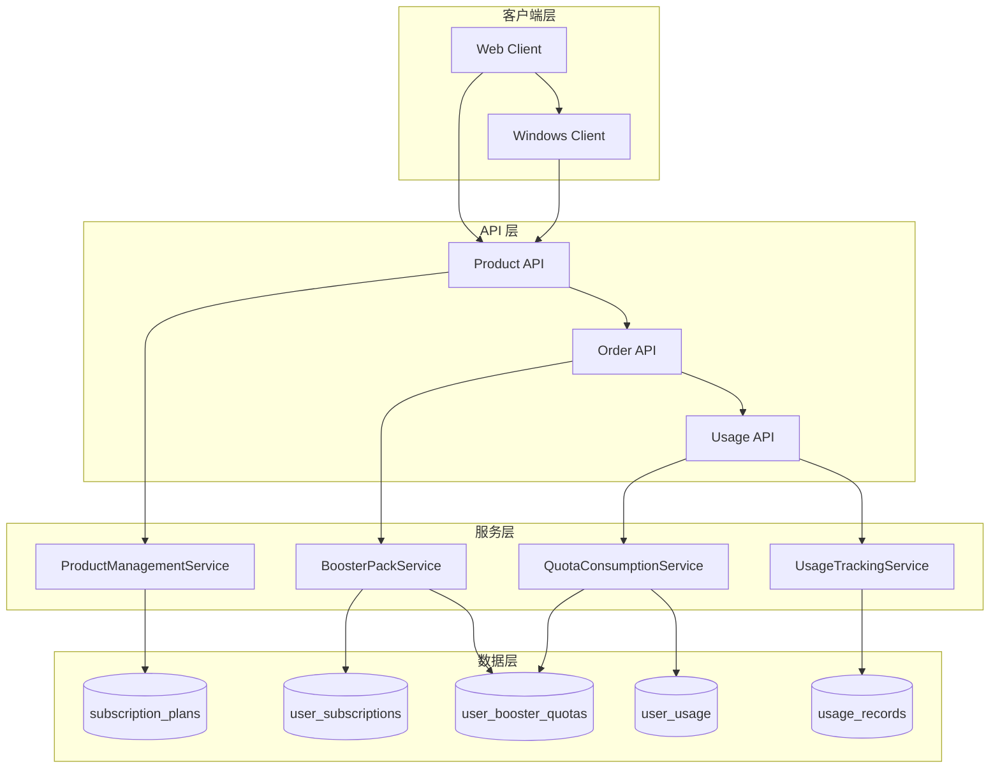

# Design Document: 加量包系统 (Booster Pack System)

## Overview

加量包系统是一个配额补充机制，允许用户在基础套餐配额不足时购买额外配额。系统设计遵循以下核心原则：

1. **独立存储** - 加量包配额与基础配额完全分离，使用独立的数据表存储
2. **FIFO 消耗** - 多个加量包按购买时间先进先出消耗
3. **优先级消耗** - 先消耗基础配额，耗尽后再消耗加量包配额
4. **独立生命周期** - 加量包有独立的过期时间，不受基础套餐变化影响
5. **事务安全** - 所有配额操作使用数据库事务确保一致性

## Architecture



## Components and Interfaces

### 1. 数据库表扩展

#### 1.1 subscription_plans 表扩展

```sql
-- 添加 plan_type 字段
ALTER TABLE subscription_plans 
ADD COLUMN plan_type VARCHAR(20) DEFAULT 'base' CHECK (plan_type IN ('base', 'booster'));

-- 添加索引
CREATE INDEX idx_subscription_plans_type ON subscription_plans(plan_type);
```

#### 1.2 user_subscriptions 表扩展

```sql
-- 添加 plan_type 字段（冗余存储，便于查询）
ALTER TABLE user_subscriptions 
ADD COLUMN plan_type VARCHAR(20) DEFAULT 'base' CHECK (plan_type IN ('base', 'booster'));
```

#### 1.3 新建 user_booster_quotas 表

```sql
CREATE TABLE user_booster_quotas (
    id SERIAL PRIMARY KEY,
    user_id INTEGER NOT NULL REFERENCES users(id) ON DELETE CASCADE,
    booster_subscription_id INTEGER NOT NULL REFERENCES user_subscriptions(id) ON DELETE CASCADE,
    feature_code VARCHAR(50) NOT NULL,
    quota_limit INTEGER NOT NULL,
    quota_used INTEGER DEFAULT 0,
    status VARCHAR(20) DEFAULT 'active' CHECK (status IN ('active', 'expired', 'exhausted')),
    created_at TIMESTAMP DEFAULT CURRENT_TIMESTAMP,
    expires_at TIMESTAMP NOT NULL,
    updated_at TIMESTAMP DEFAULT CURRENT_TIMESTAMP,
    
    CONSTRAINT positive_quota CHECK (quota_limit > 0),
    CONSTRAINT valid_usage CHECK (quota_used >= 0 AND quota_used <= quota_limit)
);

-- 索引
CREATE INDEX idx_user_booster_quotas_user_feature ON user_booster_quotas(user_id, feature_code, status);
CREATE INDEX idx_user_booster_quotas_expires ON user_booster_quotas(expires_at) WHERE status = 'active';
CREATE INDEX idx_user_booster_quotas_subscription ON user_booster_quotas(booster_subscription_id);
```

### 2. BoosterPackService

负责加量包的购买、开通和管理。

```typescript
interface BoosterPackService {
  // 检查用户是否可以购买加量包
  canPurchaseBooster(userId: number): Promise<{
    canPurchase: boolean;
    reason?: string;
  }>;
  
  // 开通加量包（支付成功后调用）
  activateBoosterPack(
    userId: number, 
    planId: number, 
    orderId: number
  ): Promise<BoosterSubscription>;
  
  // 获取用户的活跃加量包
  getUserActiveBoosterQuotas(
    userId: number, 
    featureCode?: string
  ): Promise<BoosterQuota[]>;
  
  // 获取用户的加量包汇总
  getUserBoosterSummary(userId: number): Promise<BoosterSummary>;
}

interface BoosterQuota {
  id: number;
  userId: number;
  boosterSubscriptionId: number;
  featureCode: string;
  quotaLimit: number;
  quotaUsed: number;
  remaining: number;
  status: 'active' | 'expired' | 'exhausted';
  createdAt: Date;
  expiresAt: Date;
}

interface BoosterSummary {
  [featureCode: string]: {
    totalLimit: number;
    totalUsed: number;
    totalRemaining: number;
    activePackCount: number;
    earliestExpiration: Date | null;
  };
}
```

### 3. QuotaConsumptionService

负责配额消耗逻辑，实现优先级消耗和 FIFO 策略。

```typescript
interface QuotaConsumptionService {
  // 检查用户是否有足够配额（基础 + 加量包）
  checkCombinedQuota(
    userId: number, 
    featureCode: string, 
    amount?: number
  ): Promise<QuotaCheckResult>;
  
  // 消耗配额（自动处理优先级）
  consumeQuota(
    userId: number, 
    featureCode: string, 
    amount: number,
    metadata?: any
  ): Promise<ConsumptionResult>;
  
  // 获取组合配额概览
  getCombinedQuotaOverview(userId: number): Promise<CombinedQuotaOverview[]>;
}

interface QuotaCheckResult {
  hasQuota: boolean;
  baseQuota: {
    limit: number;
    used: number;
    remaining: number;
  };
  boosterQuota: {
    totalLimit: number;
    totalUsed: number;
    totalRemaining: number;
  };
  combinedRemaining: number;
}

interface ConsumptionResult {
  success: boolean;
  consumedFrom: 'base' | 'booster';
  boosterSubscriptionId?: number;
  baseQuotaRemaining: number;
  boosterQuotaRemaining: number;
}

interface CombinedQuotaOverview {
  featureCode: string;
  featureName: string;
  baseQuota: {
    limit: number;
    used: number;
    remaining: number;
    resetTime?: string;
  };
  boosterQuota: {
    totalLimit: number;
    totalUsed: number;
    totalRemaining: number;
    activePackCount: number;
    earliestExpiration?: string;
    isBeingConsumed: boolean;
  };
  combinedRemaining: number;
}
```

### 4. 数据库函数

#### 4.1 消耗配额函数

```sql
CREATE OR REPLACE FUNCTION consume_quota_with_booster(
    p_user_id INTEGER,
    p_feature_code VARCHAR(50),
    p_amount INTEGER DEFAULT 1
) RETURNS TABLE (
    success BOOLEAN,
    consumed_from VARCHAR(20),
    booster_subscription_id INTEGER,
    base_remaining INTEGER,
    booster_remaining INTEGER
) AS $$
DECLARE
    v_base_limit INTEGER;
    v_base_used INTEGER;
    v_base_remaining INTEGER;
    v_booster_record RECORD;
    v_amount_to_consume INTEGER := p_amount;
BEGIN
    -- 1. 获取基础配额信息
    SELECT quota_limit, current_usage INTO v_base_limit, v_base_used
    FROM check_user_quota(p_user_id, p_feature_code);
    
    v_base_remaining := GREATEST(0, v_base_limit - v_base_used);
    
    -- 2. 如果基础配额足够，从基础配额消耗
    IF v_base_remaining >= p_amount THEN
        -- 更新基础配额使用量
        PERFORM record_feature_usage(p_user_id, p_feature_code, NULL, NULL, p_amount, NULL);
        
        RETURN QUERY SELECT 
            TRUE,
            'base'::VARCHAR(20),
            NULL::INTEGER,
            (v_base_remaining - p_amount)::INTEGER,
            (SELECT COALESCE(SUM(quota_limit - quota_used), 0)::INTEGER 
             FROM user_booster_quotas 
             WHERE user_id = p_user_id AND feature_code = p_feature_code AND status = 'active');
        RETURN;
    END IF;
    
    -- 3. 基础配额不足，先消耗完基础配额
    IF v_base_remaining > 0 THEN
        PERFORM record_feature_usage(p_user_id, p_feature_code, NULL, NULL, v_base_remaining, NULL);
        v_amount_to_consume := p_amount - v_base_remaining;
    END IF;
    
    -- 4. 从加量包消耗（FIFO）
    FOR v_booster_record IN 
        SELECT id, booster_subscription_id, quota_limit, quota_used
        FROM user_booster_quotas
        WHERE user_id = p_user_id 
          AND feature_code = p_feature_code 
          AND status = 'active'
          AND quota_used < quota_limit
        ORDER BY created_at ASC
    LOOP
        DECLARE
            v_booster_remaining INTEGER := v_booster_record.quota_limit - v_booster_record.quota_used;
            v_consume_from_this INTEGER := LEAST(v_amount_to_consume, v_booster_remaining);
        BEGIN
            -- 更新加量包使用量
            UPDATE user_booster_quotas 
            SET quota_used = quota_used + v_consume_from_this,
                updated_at = CURRENT_TIMESTAMP,
                status = CASE 
                    WHEN quota_used + v_consume_from_this >= quota_limit THEN 'exhausted'
                    ELSE status
                END
            WHERE id = v_booster_record.id;
            
            v_amount_to_consume := v_amount_to_consume - v_consume_from_this;
            
            IF v_amount_to_consume <= 0 THEN
                RETURN QUERY SELECT 
                    TRUE,
                    'booster'::VARCHAR(20),
                    v_booster_record.booster_subscription_id,
                    0::INTEGER,
                    (SELECT COALESCE(SUM(quota_limit - quota_used), 0)::INTEGER 
                     FROM user_booster_quotas 
                     WHERE user_id = p_user_id AND feature_code = p_feature_code AND status = 'active');
                RETURN;
            END IF;
        END;
    END LOOP;
    
    -- 5. 配额不足
    RETURN QUERY SELECT FALSE, NULL::VARCHAR(20), NULL::INTEGER, 0::INTEGER, 0::INTEGER;
END;
$$ LANGUAGE plpgsql;
```

#### 4.2 检查组合配额函数

```sql
CREATE OR REPLACE FUNCTION check_combined_quota(
    p_user_id INTEGER,
    p_feature_code VARCHAR(50)
) RETURNS TABLE (
    has_quota BOOLEAN,
    base_limit INTEGER,
    base_used INTEGER,
    base_remaining INTEGER,
    booster_total_limit INTEGER,
    booster_total_used INTEGER,
    booster_remaining INTEGER,
    combined_remaining INTEGER
) AS $$
DECLARE
    v_base_limit INTEGER;
    v_base_used INTEGER;
    v_booster_total_limit INTEGER;
    v_booster_total_used INTEGER;
BEGIN
    -- 获取基础配额
    SELECT quota_limit, current_usage INTO v_base_limit, v_base_used
    FROM check_user_quota(p_user_id, p_feature_code);
    
    v_base_limit := COALESCE(v_base_limit, 0);
    v_base_used := COALESCE(v_base_used, 0);
    
    -- 获取加量包配额汇总
    SELECT 
        COALESCE(SUM(quota_limit), 0),
        COALESCE(SUM(quota_used), 0)
    INTO v_booster_total_limit, v_booster_total_used
    FROM user_booster_quotas
    WHERE user_id = p_user_id 
      AND feature_code = p_feature_code 
      AND status = 'active';
    
    RETURN QUERY SELECT
        (GREATEST(0, v_base_limit - v_base_used) + GREATEST(0, v_booster_total_limit - v_booster_total_used)) > 0,
        v_base_limit,
        v_base_used,
        GREATEST(0, v_base_limit - v_base_used),
        v_booster_total_limit,
        v_booster_total_used,
        GREATEST(0, v_booster_total_limit - v_booster_total_used),
        GREATEST(0, v_base_limit - v_base_used) + GREATEST(0, v_booster_total_limit - v_booster_total_used);
END;
$$ LANGUAGE plpgsql;
```

### 5. API 端点

#### 5.1 商品管理 API

```typescript
// POST /api/admin/products - 创建商品（支持 plan_type）
// PUT /api/admin/products/:id - 更新商品
// GET /api/admin/products?plan_type=booster - 按类型筛选商品

interface CreateProductRequest {
  planCode: string;
  planName: string;
  planType: 'base' | 'booster';  // 新增
  price: number;
  billingCycle: 'monthly' | 'yearly';
  quotaCycleType: 'monthly' | 'yearly';
  validityPeriod: 'monthly' | 'yearly' | 'permanent';
  description?: string;
  displayOrder: number;
  features: PlanFeature[];
}
```

#### 5.2 配额查询 API

```typescript
// GET /api/usage/combined-quota/:featureCode
// 返回基础配额 + 加量包配额的组合信息

// GET /api/usage/booster-quotas
// 返回用户所有活跃的加量包配额

// GET /api/usage/booster-history?page=1&pageSize=20
// 返回加量包配额消耗历史
```

#### 5.3 购买检查 API

```typescript
// GET /api/orders/can-purchase-booster
// 检查用户是否可以购买加量包

interface CanPurchaseBoosterResponse {
  canPurchase: boolean;
  reason?: 'NOT_AUTHENTICATED' | 'NO_ACTIVE_SUBSCRIPTION';
  message?: string;
}
```


## Data Models

### 1. SubscriptionPlan (扩展)

```typescript
interface SubscriptionPlan {
  id: number;
  planCode: string;
  planName: string;
  planType: 'base' | 'booster';  // 新增字段
  price: number;
  billingCycle: 'monthly' | 'yearly';
  quotaCycleType: 'monthly' | 'yearly';
  durationDays: number;
  validityPeriod: 'monthly' | 'yearly' | 'permanent';
  isActive: boolean;
  description?: string;
  displayOrder: number;
  agentDiscountRate?: number;
  features: PlanFeature[];
  createdAt: Date;
  updatedAt: Date;
}
```

### 2. UserSubscription (扩展)

```typescript
interface UserSubscription {
  id: number;
  userId: number;
  planId: number;
  planType: 'base' | 'booster';  // 新增字段（冗余存储）
  status: 'active' | 'expired' | 'cancelled' | 'replaced';
  startDate: Date;
  endDate: Date;
  pausedAt?: Date;
  pauseReason?: string;
  isGift: boolean;
  customQuotas?: Record<string, number>;
  createdAt: Date;
  updatedAt: Date;
}
```

### 3. UserBoosterQuota (新增)

```typescript
interface UserBoosterQuota {
  id: number;
  userId: number;
  boosterSubscriptionId: number;
  featureCode: string;
  quotaLimit: number;
  quotaUsed: number;
  status: 'active' | 'expired' | 'exhausted';
  createdAt: Date;
  expiresAt: Date;
  updatedAt: Date;
}
```

### 4. CombinedQuotaOverview (API 响应)

```typescript
interface CombinedQuotaOverview {
  featureCode: string;
  featureName: string;
  baseQuota: {
    limit: number;
    used: number;
    remaining: number;
    percentage: number;
    resetTime?: string;
  };
  boosterQuota: {
    totalLimit: number;
    totalUsed: number;
    totalRemaining: number;
    activePackCount: number;
    earliestExpiration?: string;
    isBeingConsumed: boolean;  // 基础配额耗尽，正在消耗加量包
    expirationWarning?: boolean;  // 7天内过期警告
  };
  combinedRemaining: number;
}
```

## Correctness Properties

*A property is a characteristic or behavior that should hold true across all valid executions of a system—essentially, a formal statement about what the system should do. Properties serve as the bridge between human-readable specifications and machine-verifiable correctness guarantees.*

### Property 1: Booster Pack Validation

*For any* booster pack creation request, if the request has no features with feature_value > 0, the system should reject the creation with a validation error.

**Validates: Requirements 1.2, 7.3**

### Property 2: Purchase Eligibility

*For any* user attempting to purchase a booster pack, the purchase should succeed if and only if the user is authenticated AND has an active subscription (including free plan).

**Validates: Requirements 2.1, 2.3, 11.2, 11.4, 11.5**

### Property 3: Quota Snapshot Immutability

*For any* booster pack purchase, the quota_limit values in user_booster_quotas should equal the plan_features.feature_value at purchase time, and should remain unchanged even if the plan_features are subsequently modified.

**Validates: Requirements 3.2, 3.3**

### Property 4: Consumption Priority

*For any* quota consumption operation, if base quota has remaining capacity (used < limit), the system should consume from base quota only; if base quota is exhausted, the system should consume from booster quota.

**Validates: Requirements 4.1, 4.2, 4.3**

### Property 5: FIFO Consumption Order

*For any* user with multiple active booster packs for the same feature, when consuming booster quota, the system should consume from the booster pack with the earliest created_at timestamp first.

**Validates: Requirements 4.4, 4.5**

### Property 6: Transaction Atomicity

*For any* quota consumption operation that spans base and booster quotas, either all updates succeed or none succeed (no partial updates).

**Validates: Requirements 4.6**

### Property 7: Combined Quota Response Structure

*For any* combined quota query response, the response should contain: featureCode, featureName, baseQuota (with limit, used, remaining, percentage, resetTime), boosterQuota (with totalLimit, totalUsed, totalRemaining, activePackCount, earliestExpiration, isBeingConsumed), and combinedRemaining.

**Validates: Requirements 5.2, 5.3**

### Property 8: Booster Quota Visibility

*For any* user without active booster quotas for a feature, the boosterQuota section should be empty or hidden in the response.

**Validates: Requirements 5.4**

### Property 9: Expiration Warning

*For any* active booster quota with expires_at within 7 days, the system should include an expiration warning flag in the response.

**Validates: Requirements 5.6**

### Property 10: Activation Record Creation

*For any* booster pack activation, the system should create: (1) a subscription record with plan_type='booster', (2) quota records in user_booster_quotas for each feature, (3) an audit record in usage_records with type='booster_activation'.

**Validates: Requirements 6.1, 6.2, 6.6**

### Property 11: Expiration Calculation

*For any* booster pack activation, the expires_at should equal activation_time + duration_days (from the plan configuration).

**Validates: Requirements 6.3**

### Property 12: Independent Lifecycle

*For any* user with active booster quotas, changes to the base subscription (expiration, upgrade, downgrade, renewal) should NOT affect the booster quotas' status, quota_limit, quota_used, or expires_at values.

**Validates: Requirements 10.1, 10.2, 10.4, 10.6, 10.7**

### Property 13: Free Plan Booster Consumption

*For any* user on free plan with active booster quotas, after exhausting free plan's base quota, the system should allow consumption from booster quotas.

**Validates: Requirements 10.3, 10.5**

### Property 14: Expiration Status Update

*For any* booster quota where expires_at < CURRENT_TIMESTAMP, the status should be updated to 'expired' and the quota should not be available for consumption.

**Validates: Requirements 3.4, 9.1, 9.2**

### Property 15: Expired Record Retention

*For any* expired booster quota, the record should be retained in the database (not deleted) for historical reference.

**Validates: Requirements 9.3**

### Property 16: Active-Only Display

*For any* booster quota query, only records with status='active' should be included in the available quota calculation.

**Validates: Requirements 9.4**

### Property 17: Deletion Protection

*For any* booster pack product with active user subscriptions, deletion should be rejected.

**Validates: Requirements 1.5**

### Property 18: Multiple Purchase Allowed

*For any* user with an active subscription, purchasing multiple booster packs of the same type should succeed without limit.

**Validates: Requirements 2.4, 2.5**

### Property 19: Audit Trail Completeness

*For any* booster quota consumption, a record should be created in usage_records with source='booster' and the corresponding booster_subscription_id.

**Validates: Requirements 8.4**

### Property 20: Combined Quota Check

*For any* quota availability check, the system should return true if (base_remaining + booster_remaining) >= requested_amount.

**Validates: Requirements 8.3**

## Error Handling

### Error Codes

| Code | Message | Description |
|------|---------|-------------|
| `NOT_AUTHENTICATED` | 请先登录 | 用户未认证 |
| `NO_ACTIVE_SUBSCRIPTION` | 请先激活订阅 | 用户没有活跃的基础订阅 |
| `INVALID_BOOSTER_CONFIG` | 加量包配置无效，至少需要一个配额项 | 加量包没有有效的功能配额 |
| `BOOSTER_HAS_ACTIVE_SUBSCRIPTIONS` | 该加量包有活跃订阅，无法删除 | 尝试删除有活跃订阅的加量包 |
| `INSUFFICIENT_QUOTA` | 配额不足 | 基础配额和加量包配额都已耗尽 |
| `BOOSTER_EXPIRED` | 加量包已过期 | 尝试使用已过期的加量包 |
| `BOOSTER_NOT_FOUND` | 加量包不存在 | 指定的加量包ID不存在 |

### Error Response Format

```typescript
interface ErrorResponse {
  success: false;
  error: {
    code: string;
    message: string;
    details?: any;
  };
}
```

## Testing Strategy

### Unit Tests

1. **BoosterPackService Tests**
   - 测试购买资格检查逻辑
   - 测试加量包激活流程
   - 测试配额初始化

2. **QuotaConsumptionService Tests**
   - 测试消耗优先级逻辑
   - 测试 FIFO 消耗顺序
   - 测试配额耗尽处理

3. **Database Function Tests**
   - 测试 consume_quota_with_booster 函数
   - 测试 check_combined_quota 函数

### Property-Based Tests

使用 fast-check 库进行属性测试，每个属性测试至少运行 100 次迭代。

```typescript
// 示例：消耗优先级属性测试
describe('Property 4: Consumption Priority', () => {
  it('should consume from base quota first when available', () => {
    fc.assert(
      fc.property(
        fc.integer({ min: 1, max: 100 }),  // baseLimit
        fc.integer({ min: 0, max: 99 }),   // baseUsed
        fc.integer({ min: 1, max: 100 }),  // boosterLimit
        fc.integer({ min: 1, max: 10 }),   // consumeAmount
        async (baseLimit, baseUsed, boosterLimit, consumeAmount) => {
          // Setup: Create user with base quota and booster quota
          // Action: Consume quota
          // Assert: If base has remaining, only base is consumed
          const baseRemaining = baseLimit - baseUsed;
          if (baseRemaining >= consumeAmount) {
            // Verify only base quota was consumed
          }
        }
      ),
      { numRuns: 100 }
    );
  });
});
```

### Integration Tests

1. **端到端购买流程测试**
   - 创建加量包商品 → 用户购买 → 支付确认 → 配额初始化

2. **配额消耗流程测试**
   - 消耗基础配额 → 耗尽 → 消耗加量包配额 → 耗尽 → 拒绝

3. **生命周期独立性测试**
   - 购买加量包 → 基础套餐过期 → 验证加量包仍可用

4. **过期处理测试**
   - 创建即将过期的加量包 → 运行过期检查 → 验证状态更新

### Test Data Generators

```typescript
// 生成随机加量包配置
const boosterPackArbitrary = fc.record({
  planCode: fc.string({ minLength: 3, maxLength: 20 }),
  planName: fc.string({ minLength: 1, maxLength: 50 }),
  price: fc.integer({ min: 1, max: 10000 }),
  durationDays: fc.integer({ min: 1, max: 365 }),
  features: fc.array(
    fc.record({
      featureCode: fc.constantFrom('articles_per_month', 'publish_per_month', 'keyword_distillation'),
      featureValue: fc.integer({ min: 1, max: 1000 })
    }),
    { minLength: 1, maxLength: 5 }
  )
});

// 生成随机用户配额状态
const userQuotaStateArbitrary = fc.record({
  baseLimit: fc.integer({ min: 0, max: 100 }),
  baseUsed: fc.integer({ min: 0, max: 100 }),
  boosterPacks: fc.array(
    fc.record({
      quotaLimit: fc.integer({ min: 1, max: 100 }),
      quotaUsed: fc.integer({ min: 0, max: 100 }),
      createdAt: fc.date({ min: new Date('2024-01-01'), max: new Date() })
    }),
    { minLength: 0, maxLength: 5 }
  )
});
```
