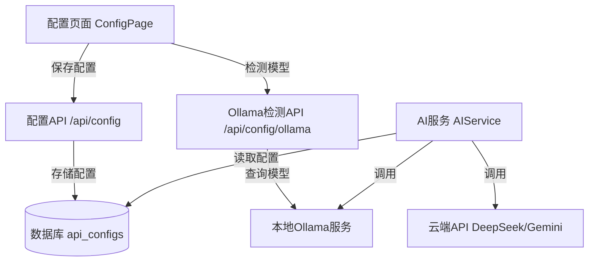

# 设计文档

## 概述

本设计文档描述了如何在现有的AI API配置模块中集成本地Ollama支持。该功能将允许用户选择使用本地部署的DeepSeek大模型，而不是依赖云端API服务。系统将自动检测本地Ollama服务中已安装的模型，并提供无缝的配置和使用体验。

核心设计目标：
- 最小化对现有代码的侵入性修改
- 提供统一的AI服务接口，屏蔽底层实现差异
- 确保配置的持久化和可恢复性
- 提供友好的用户体验和错误处理

## 架构

### 整体架构图



### 数据流

1. **配置流程**:
   - 用户在UI选择"本地Ollama" → 前端调用Ollama检测API → 后端查询Ollama服务 → 返回可用模型列表 → 用户选择模型并保存 → 配置存入数据库

2. **使用流程**:
   - 用户触发AI任务 → AIService读取活动配置 → 根据provider类型选择调用方式 → 调用Ollama或云端API → 返回结果

## 组件和接口

### 1. 数据库Schema扩展

需要修改`api_configs`表以支持Ollama配置：

```sql
-- 修改现有表结构
ALTER TABLE api_configs 
  ALTER COLUMN provider TYPE VARCHAR(20),
  DROP CONSTRAINT api_configs_provider_check,
  ADD CONSTRAINT api_configs_provider_check 
    CHECK (provider IN ('deepseek', 'gemini', 'ollama'));

-- api_key对于ollama是可选的
ALTER TABLE api_configs 
  ALTER COLUMN api_key DROP NOT NULL;

-- 添加新字段
ALTER TABLE api_configs 
  ADD COLUMN IF NOT EXISTS ollama_base_url VARCHAR(255),
  ADD COLUMN IF NOT EXISTS ollama_model VARCHAR(100);
```

### 2. Ollama服务接口

创建新的服务类`OllamaService`用于与Ollama交互：

```typescript
interface OllamaModel {
  name: string;
  size: number;
  modified_at: string;
}

interface OllamaListResponse {
  models: OllamaModel[];
}

interface OllamaChatRequest {
  model: string;
  messages: Array<{
    role: string;
    content: string;
  }>;
  stream: boolean;
  options?: {
    temperature?: number;
    num_predict?: number;
  };
}

interface OllamaChatResponse {
  model: string;
  message: {
    role: string;
    content: string;
  };
  done: boolean;
}

class OllamaService {
  constructor(private baseUrl: string) {}
  
  // 检测Ollama服务是否可用
  async checkConnection(): Promise<boolean>
  
  // 获取已安装的模型列表
  async listModels(): Promise<OllamaModel[]>
  
  // 过滤DeepSeek模型
  async getDeepSeekModels(): Promise<OllamaModel[]>
  
  // 调用Ollama进行对话
  async chat(request: OllamaChatRequest): Promise<string>
}
```

### 3. AI服务扩展

修改`AIService`类以支持Ollama：

```typescript
export type AIProvider = 'deepseek' | 'gemini' | 'ollama';

interface AIConfig {
  provider: AIProvider;
  apiKey?: string;  // ollama不需要
  ollamaBaseUrl?: string;
  ollamaModel?: string;
}

export class AIService {
  private config: AIConfig;
  private ollamaService?: OllamaService;

  constructor(config: AIConfig) {
    this.config = config;
    if (config.provider === 'ollama') {
      this.ollamaService = new OllamaService(
        config.ollamaBaseUrl || 'http://localhost:11434'
      );
    }
  }

  private async callAI(prompt: string): Promise<string> {
    switch (this.config.provider) {
      case 'deepseek':
        return await this.callDeepSeek(prompt);
      case 'gemini':
        return await this.callGemini(prompt);
      case 'ollama':
        return await this.callOllama(prompt);
      default:
        throw new Error(`Unsupported provider: ${this.config.provider}`);
    }
  }

  private async callOllama(prompt: string): Promise<string> {
    // 实现Ollama调用逻辑
  }
}
```

### 4. 配置API扩展

在`config.ts`中添加新的端点：

```typescript
// GET /api/config/ollama/models
// 检测本地Ollama中的DeepSeek模型
configRouter.get('/ollama/models', async (req, res) => {
  const baseUrl = req.query.baseUrl as string || 'http://localhost:11434';
  // 返回模型列表
});

// POST /api/config/ollama/test
// 测试Ollama连接和模型可用性
configRouter.post('/ollama/test', async (req, res) => {
  const { baseUrl, model } = req.body;
  // 测试连接并返回结果
});

// 修改现有的POST /api/config端点以支持Ollama配置
configRouter.post('/', async (req, res) => {
  const { provider, apiKey, ollamaBaseUrl, ollamaModel } = req.body;
  // 根据provider类型保存不同的配置
});
```

### 5. 前端UI组件

修改`ConfigPage.tsx`以支持Ollama选项：

```typescript
interface ConfigFormValues {
  provider: 'deepseek' | 'gemini' | 'ollama';
  apiKey?: string;
  ollamaBaseUrl?: string;
  ollamaModel?: string;
}

// 新增状态
const [ollamaModels, setOllamaModels] = useState<string[]>([]);
const [detectingModels, setDetectingModels] = useState(false);
const [selectedProvider, setSelectedProvider] = useState<string>('');

// 新增方法
const detectOllamaModels = async (baseUrl: string) => {
  // 调用API检测模型
};

const handleProviderChange = (value: string) => {
  setSelectedProvider(value);
  if (value === 'ollama') {
    detectOllamaModels('http://localhost:11434');
  }
};
```

## 数据模型

### 配置数据模型

```typescript
interface APIConfig {
  id: number;
  provider: 'deepseek' | 'gemini' | 'ollama';
  apiKey?: string;
  ollamaBaseUrl?: string;
  ollamaModel?: string;
  isActive: boolean;
  createdAt: Date;
  updatedAt: Date;
}
```

### Ollama模型数据模型

```typescript
interface OllamaModelInfo {
  name: string;          // 例如: "deepseek-r1:latest"
  displayName: string;   // 例如: "DeepSeek R1 (Latest)"
  size: number;          // 模型大小（字节）
  sizeFormatted: string; // 例如: "7.2 GB"
  modifiedAt: Date;
}
```


## 正确性属性预分析

在编写正确性属性之前，让我先分析需求文档中的验收标准，确定哪些可以转化为可测试的属性。

### 需求 1 - UI配置选项

1.1 WHEN 用户访问配置页面 THEN 系统 SHALL 在AI模型选择下拉框中显示"本地Ollama"选项
  思考: 这是UI渲染测试，可以验证下拉框选项是否包含"ollama"值
  可测试性: yes - example

1.2 WHEN 用户选择"本地Ollama"选项 THEN 系统 SHALL 隐藏API Key输入框
  思考: 这是UI状态测试，可以验证当provider为"ollama"时，API Key字段不显示
  可测试性: yes - example

1.3 WHEN 用户选择"本地Ollama"选项 THEN 系统 SHALL 显示Ollama服务地址配置字段
  思考: 这是UI状态测试，可以验证当provider为"ollama"时，显示baseUrl字段
  可测试性: yes - example

1.4 WHEN 用户选择云端API选项 THEN 系统 SHALL 显示API Key输入框并隐藏Ollama服务地址字段
  思考: 这是UI状态测试，验证provider切换时字段显示逻辑
  可测试性: yes - example

### 需求 2 - 自动模型检测

2.1 WHEN 用户选择"本地Ollama"选项 THEN 系统 SHALL 自动调用Ollama API检测已安装的模型列表
  思考: 这是API调用行为测试，可以验证选择ollama时是否触发检测请求
  可测试性: yes - property

2.2 WHEN Ollama服务可访问且包含DeepSeek模型 THEN 系统 SHALL 显示所有可用的DeepSeek模型
  思考: 这是模型过滤逻辑测试，可以用不同的模型列表验证过滤结果
  可测试性: yes - property

2.3 WHEN Ollama服务不可访问 THEN 系统 SHALL 显示友好的错误提示
  思考: 这是错误处理测试，验证连接失败时的错误消息
  可测试性: yes - example

2.4 WHEN Ollama服务中没有DeepSeek模型 THEN 系统 SHALL 显示提示信息
  思考: 这是边界情况测试，验证空结果时的提示
  可测试性: edge-case

2.5 WHEN 检测到多个DeepSeek模型版本 THEN 系统 SHALL 显示所有版本供用户选择
  思考: 这是列表显示测试，验证多个模型都能正确显示
  可测试性: yes - property

### 需求 3 - 连接测试

3.1 WHEN 用户点击"测试连接"按钮 THEN 系统 SHALL 向Ollama服务发送测试请求
  思考: 这是API调用测试，验证测试按钮触发正确的请求
  可测试性: yes - example

3.2 WHEN Ollama连接测试成功 THEN 系统 SHALL 显示"连接成功"消息
  思考: 这是成功响应处理测试
  可测试性: yes - example

3.3 WHEN Ollama连接测试失败 THEN 系统 SHALL 显示具体的错误信息
  思考: 这是错误响应处理测试
  可测试性: yes - example

3.4 WHEN 用户修改Ollama服务地址 THEN 系统 SHALL 自动重新检测可用模型列表
  思考: 这是响应式行为测试，验证地址变化触发重新检测
  可测试性: yes - property

### 需求 4 - 功能集成

4.1 WHEN 系统配置为使用本地Ollama THEN AI服务 SHALL 通过Ollama API调用本地模型
  思考: 这是路由逻辑测试，验证配置决定调用路径
  可测试性: yes - property

4.2 WHEN 执行关键词蒸馏任务 THEN 系统 SHALL 使用配置的Ollama模型生成问题列表
  思考: 这是端到端功能测试，验证Ollama能完成蒸馏任务
  可测试性: yes - example

4.3 WHEN 执行文章生成任务 THEN 系统 SHALL 使用配置的Ollama模型生成文章内容
  思考: 这是端到端功能测试，验证Ollama能完成生成任务
  可测试性: yes - example

4.4 WHEN Ollama API调用失败 THEN 系统 SHALL 返回清晰的错误信息并记录日志
  思考: 这是错误处理测试，验证失败时的错误传播
  可测试性: yes - property

4.5 WHEN Ollama模型响应格式与云端API不同 THEN 系统 SHALL 正确解析Ollama响应格式
  思考: 这是响应解析测试，这是一个关键的适配逻辑，应该作为属性测试
  可测试性: yes - property

### 需求 5 - 配置持久化

5.1 WHEN 用户保存Ollama配置 THEN 系统 SHALL 将配置信息存储到数据库
  思考: 这是数据持久化测试，验证保存后能从数据库读取
  可测试性: yes - property

5.2 WHEN 系统启动时 THEN 系统 SHALL 从数据库加载最后保存的AI配置
  思考: 这是配置加载测试，验证启动时读取正确配置
  可测试性: yes - example

5.3 WHEN 加载的配置为Ollama类型 THEN 系统 SHALL 验证Ollama服务可用性
  思考: 这是启动验证测试，验证加载后的健康检查
  可测试性: yes - example

5.4 WHEN 存储的Ollama配置包含服务地址和模型名称 THEN 系统 SHALL 完整保存并恢复这些信息
  思考: 这是配置完整性测试，这是一个往返属性（round-trip）
  可测试性: yes - property

### 需求 6 - 服务切换

6.1 WHEN 用户从云端API切换到Ollama THEN 系统 SHALL 清除之前的API Key配置
  思考: 这是配置清理测试，验证切换时清除旧配置
  可测试性: yes - property

6.2 WHEN 用户从Ollama切换到云端API THEN 系统 SHALL 清除之前的Ollama配置
  思考: 这是配置清理测试，验证反向切换时清除旧配置
  可测试性: yes - property

6.3 WHEN 切换AI提供商后 THEN 系统 SHALL 使用新配置的服务进行后续AI调用
  思考: 这是配置生效测试，验证切换后立即使用新配置
  可测试性: yes - property

6.4 WHEN 配置切换过程中发生错误 THEN 系统 SHALL 保持原有配置不变并提示用户
  思考: 这是事务性测试，验证失败时的回滚行为
  可测试性: yes - property

### 属性反思

审查所有标记为可测试的属性，识别冗余：

**冗余分析**:
- 属性 1.2 和 1.3 可以合并为一个属性：当provider改变时，UI字段显示状态应该正确
- 属性 2.2 和 2.5 都在测试模型列表显示，可以合并为：过滤后的模型列表应该只包含DeepSeek模型
- 属性 6.1 和 6.2 是对称的，可以合并为：切换provider时应该清除旧provider的特定配置
- 属性 4.2 和 4.3 都在测试Ollama能否完成任务，可以合并为一个综合测试

**保留的核心属性**:
1. UI字段显示根据provider正确切换
2. 模型检测返回的列表只包含DeepSeek模型
3. 配置保存和加载的往返一致性（round-trip）
4. provider切换时正确清理旧配置
5. AI服务根据配置路由到正确的API
6. Ollama响应格式正确解析
7. 错误情况下的优雅处理

## 正确性属性

*属性是一个特征或行为，应该在系统的所有有效执行中保持为真——本质上是关于系统应该做什么的形式化陈述。属性作为人类可读规范和机器可验证正确性保证之间的桥梁。*

### 属性 1: UI字段显示一致性

*对于任何* provider选择（deepseek、gemini、ollama），UI应该只显示该provider所需的配置字段，并隐藏其他provider的字段。具体来说：
- 当provider为"ollama"时，应显示ollamaBaseUrl和ollamaModel字段，隐藏apiKey字段
- 当provider为"deepseek"或"gemini"时，应显示apiKey字段，隐藏ollama相关字段

**验证: 需求 1.2, 1.3, 1.4**

### 属性 2: DeepSeek模型过滤完整性

*对于任何* Ollama返回的模型列表，过滤后的结果应该满足：
- 所有返回的模型名称都包含"deepseek"（不区分大小写）
- 原始列表中所有包含"deepseek"的模型都应该出现在过滤结果中
- 过滤结果的数量应该等于原始列表中DeepSeek模型的数量

**验证: 需求 2.2, 2.5**

### 属性 3: 配置往返一致性

*对于任何* 有效的Ollama配置（包含provider、ollamaBaseUrl、ollamaModel），将配置保存到数据库后再读取，应该得到完全相同的配置信息。这是一个round-trip属性。

**验证: 需求 5.1, 5.4**

### 属性 4: Provider切换时配置清理

*对于任何* 从providerA切换到providerB的操作，保存后的配置应该：
- 只包含providerB所需的字段
- 不包含providerA特有的字段（如从ollama切换到deepseek时，ollamaBaseUrl和ollamaModel应该被清除或设为null）

**验证: 需求 6.1, 6.2**

### 属性 5: AI服务路由正确性

*对于任何* 配置的provider类型，当AIService执行任务时，应该调用对应的API端点：
- provider为"ollama"时，应该调用本地Ollama API（http://localhost:11434或配置的地址）
- provider为"deepseek"时，应该调用DeepSeek云端API
- provider为"gemini"时，应该调用Gemini云端API

**验证: 需求 4.1**

### 属性 6: Ollama响应解析正确性

*对于任何* Ollama API返回的有效响应，AIService应该能够提取出文本内容，并且提取的内容应该：
- 不为空（当Ollama返回了内容时）
- 与Ollama响应中的message.content字段一致
- 格式与云端API返回的格式统一（都是纯文本字符串）

**验证: 需求 4.5**

### 属性 7: 地址变化触发重新检测

*对于任何* ollamaBaseUrl的变化，系统应该自动触发新的模型检测请求，并且：
- 新请求使用更新后的baseUrl
- 模型列表应该更新为新地址返回的结果
- 如果新地址不可访问，应该显示相应的错误信息

**验证: 需求 3.4**

### 属性 8: 错误处理不影响系统状态

*对于任何* 配置操作（保存、测试、检测模型）的失败，系统应该：
- 保持原有的活动配置不变
- 返回包含错误详情的错误消息
- 不会导致系统进入不一致状态（如部分配置被保存）

**验证: 需求 6.4, 4.4**

## 错误处理

### 1. Ollama连接错误

**场景**: Ollama服务未启动或不可访问

**处理策略**:
- 捕获网络连接错误（ECONNREFUSED, ETIMEDOUT）
- 返回用户友好的错误消息："无法连接到Ollama服务，请确保Ollama已启动并运行在 {baseUrl}"
- 在UI上显示错误提示，并提供Ollama安装和启动指引链接
- 不阻止用户配置其他provider

### 2. 模型不存在错误

**场景**: 配置的模型在Ollama中不存在

**处理策略**:
- 在保存配置前验证模型是否存在
- 如果模型不存在，返回错误："模型 {modelName} 未安装，请先使用 'ollama pull {modelName}' 安装"
- 提供模型安装命令的复制按钮
- 允许用户重新选择其他已安装的模型

### 3. Ollama API响应格式错误

**场景**: Ollama返回的数据格式不符合预期

**处理策略**:
- 使用TypeScript类型守卫验证响应结构
- 如果响应格式错误，记录详细日志用于调试
- 返回通用错误："Ollama响应格式异常，请检查Ollama版本是否兼容"
- 建议用户更新Ollama到最新版本

### 4. 模型推理超时

**场景**: Ollama模型响应时间过长

**处理策略**:
- 设置合理的超时时间（如60秒）
- 超时后取消请求并返回错误
- 提示用户："模型响应超时，可能是模型过大或系统资源不足"
- 建议用户尝试使用更小的模型或增加系统资源

### 5. 配置切换失败

**场景**: 从一个provider切换到另一个时数据库操作失败

**处理策略**:
- 使用数据库事务确保原子性
- 如果事务失败，回滚所有更改
- 保持原有配置不变
- 返回错误："配置更新失败，已保持原有配置"

### 6. 并发配置冲突

**场景**: 多个用户或请求同时修改配置

**处理策略**:
- 使用数据库行锁或乐观锁
- 检测配置版本冲突
- 如果检测到冲突，拒绝后来的请求
- 提示用户刷新页面获取最新配置

## 测试策略

### 单元测试

**OllamaService测试**:
- 测试`checkConnection()`在服务可用和不可用时的行为
- 测试`listModels()`正确解析Ollama API响应
- 测试`getDeepSeekModels()`正确过滤模型列表
- 测试`chat()`正确构造请求和解析响应
- 测试各种错误情况的处理

**AIService测试**:
- 测试provider路由逻辑（根据配置调用正确的方法）
- 测试Ollama调用与云端API调用的一致性
- 测试错误传播和处理
- 使用mock避免实际的网络调用

**配置API测试**:
- 测试`/api/config/ollama/models`端点返回正确的模型列表
- 测试`/api/config/ollama/test`端点的连接测试逻辑
- 测试配置保存时的数据验证
- 测试配置切换时的清理逻辑

### 属性测试

**属性测试框架**: 使用`fast-check`库进行JavaScript/TypeScript的属性测试

**配置往返测试** (属性3):
```typescript
// 生成随机的Ollama配置
const configArbitrary = fc.record({
  provider: fc.constant('ollama'),
  ollamaBaseUrl: fc.webUrl(),
  ollamaModel: fc.constantFrom('deepseek-r1:latest', 'deepseek-coder:latest')
});

// 属性：保存后读取应该得到相同的配置
fc.assert(
  fc.property(configArbitrary, async (config) => {
    const saved = await saveConfig(config);
    const loaded = await loadConfig(saved.id);
    expect(loaded).toEqual(config);
  }),
  { numRuns: 100 }
);
```

**模型过滤测试** (属性2):
```typescript
// 生成随机的模型列表
const modelListArbitrary = fc.array(
  fc.record({
    name: fc.oneof(
      fc.constant('deepseek-r1:latest'),
      fc.constant('llama2:latest'),
      fc.constant('deepseek-coder:7b'),
      fc.constant('mistral:latest')
    )
  })
);

// 属性：过滤后只包含deepseek模型
fc.assert(
  fc.property(modelListArbitrary, (models) => {
    const filtered = filterDeepSeekModels(models);
    const allAreDeepSeek = filtered.every(m => 
      m.name.toLowerCase().includes('deepseek')
    );
    const countMatches = filtered.length === 
      models.filter(m => m.name.toLowerCase().includes('deepseek')).length;
    expect(allAreDeepSeek && countMatches).toBe(true);
  }),
  { numRuns: 100 }
);
```

**Provider切换清理测试** (属性4):
```typescript
// 生成provider切换场景
const switchScenario = fc.tuple(
  fc.constantFrom('deepseek', 'gemini', 'ollama'),
  fc.constantFrom('deepseek', 'gemini', 'ollama')
).filter(([from, to]) => from !== to);

// 属性：切换后不应包含旧provider的字段
fc.assert(
  fc.property(switchScenario, async ([fromProvider, toProvider]) => {
    // 设置初始配置
    await saveConfig(createConfigFor(fromProvider));
    // 切换到新provider
    const newConfig = await saveConfig(createConfigFor(toProvider));
    
    // 验证旧字段被清除
    if (fromProvider === 'ollama') {
      expect(newConfig.ollamaBaseUrl).toBeNull();
      expect(newConfig.ollamaModel).toBeNull();
    }
    if (toProvider !== 'ollama') {
      expect(newConfig.apiKey).toBeDefined();
    }
  }),
  { numRuns: 100 }
);
```

**UI字段显示测试** (属性1):
```typescript
// 生成provider选择
const providerArbitrary = fc.constantFrom('deepseek', 'gemini', 'ollama');

// 属性：UI字段显示与provider一致
fc.assert(
  fc.property(providerArbitrary, (provider) => {
    const visibleFields = getVisibleFields(provider);
    
    if (provider === 'ollama') {
      expect(visibleFields).toContain('ollamaBaseUrl');
      expect(visibleFields).toContain('ollamaModel');
      expect(visibleFields).not.toContain('apiKey');
    } else {
      expect(visibleFields).toContain('apiKey');
      expect(visibleFields).not.toContain('ollamaBaseUrl');
      expect(visibleFields).not.toContain('ollamaModel');
    }
  }),
  { numRuns: 100 }
);
```

### 集成测试

**端到端配置流程**:
1. 启动测试环境（包括数据库和mock Ollama服务）
2. 通过UI选择Ollama provider
3. 验证模型检测API被调用
4. 选择模型并保存配置
5. 验证配置被正确保存到数据库
6. 触发AI任务，验证使用Ollama执行

**Provider切换流程**:
1. 配置并保存DeepSeek云端API
2. 执行一个AI任务，验证使用云端API
3. 切换到Ollama配置
4. 执行相同的AI任务，验证使用Ollama
5. 验证两次结果格式一致

### 测试配置

- 属性测试运行次数：每个属性至少100次迭代
- 使用测试数据库，每个测试后清理
- Mock外部服务（Ollama、云端API）以提高测试速度和可靠性
- 集成测试使用真实的Ollama服务（如果可用）

## 实现注意事项

1. **向后兼容性**: 确保现有的DeepSeek和Gemini配置不受影响
2. **性能考虑**: Ollama模型检测可能较慢，使用loading状态提升用户体验
3. **安全性**: 虽然Ollama不需要API Key，但仍需验证baseUrl格式防止注入攻击
4. **可扩展性**: 设计应该便于未来添加其他本地模型服务（如LM Studio）
5. **日志记录**: 详细记录Ollama交互日志，便于问题排查
6. **版本兼容**: 文档说明支持的Ollama版本范围
