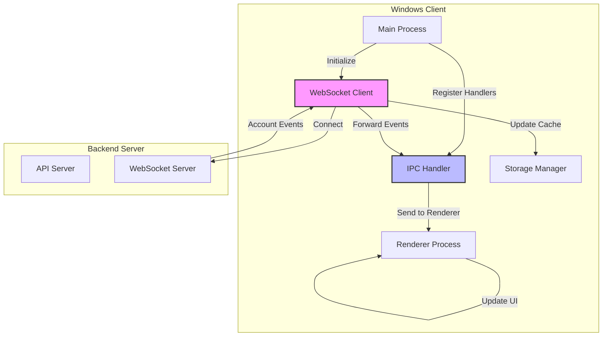

# Design Document: Windows WebSocket Integration

## Overview

This design implements real-time account synchronization for the Windows login manager by integrating the existing WebSocket client with the application lifecycle. The WebSocket client code already exists but is not being initialized or used. This design will connect the WebSocket client to the main application, handle account events, and forward them to the renderer process for UI updates.

## Architecture

### Component Diagram



### Data Flow

1. **Initialization Flow**:
   - Main process loads configuration
   - Main process initializes WebSocket client with server URL
   - WebSocket client connects to backend server
   - WebSocket client authenticates using stored tokens

2. **Event Reception Flow**:
   - Backend broadcasts account event (created/updated/deleted)
   - WebSocket client receives event
   - WebSocket client updates local cache
   - WebSocket client forwards event to IPC handler
   - IPC handler broadcasts event to all renderer processes
   - Renderer processes update UI

3. **Reconnection Flow**:
   - WebSocket detects connection loss
   - WebSocket attempts reconnection with exponential backoff
   - On successful reconnection, WebSocket re-authenticates
   - WebSocket resumes event reception

## Components and Interfaces

### 1. WebSocket Manager (New)

A new manager class that wraps the existing WebSocket client and integrates it with the application lifecycle.

```typescript
interface WebSocketManagerConfig {
  serverUrl: string;
  token: string;
}

class WebSocketManager {
  private wsClient: WebSocketClient | null;
  private config: WebSocketManagerConfig | null;
  
  /**
   * Initialize WebSocket connection
   */
  async initialize(config: WebSocketManagerConfig): Promise<void>;
  
  /**
   * Disconnect WebSocket
   */
  disconnect(): void;
  
  /**
   * Reconnect with new configuration
   */
  async reconnect(config: WebSocketManagerConfig): Promise<void>;
  
  /**
   * Check if connected
   */
  isConnected(): boolean;
  
  /**
   * Get connection status
   */
  getStatus(): {
    connected: boolean;
    authenticated: boolean;
    reconnectAttempts: number;
  };
}
```

### 2. Main Process Integration

Modify `main.ts` to initialize and manage the WebSocket connection.

```typescript
class ApplicationManager {
  private wsManager: WebSocketManager;
  
  async initialize(): Promise<void> {
    // ... existing initialization ...
    
    // Initialize WebSocket after config is loaded
    await this.initializeWebSocket();
  }
  
  private async initializeWebSocket(): Promise<void> {
    const config = await storageManager.getConfig();
    if (config.serverUrl) {
      const wsUrl = this.deriveWebSocketUrl(config.serverUrl);
      const tokens = await storageManager.getTokens();
      
      if (tokens?.accessToken) {
        await this.wsManager.initialize({
          serverUrl: wsUrl,
          token: tokens.accessToken
        });
      }
    }
  }
  
  private deriveWebSocketUrl(httpUrl: string): string {
    const url = new URL(httpUrl);
    const protocol = url.protocol === 'https:' ? 'wss:' : 'ws:';
    return `${protocol}//${url.host}/ws`;
  }
}
```

### 3. IPC Handler Extension

Extend the IPC handler to forward WebSocket events to renderer processes.

```typescript
class IPCHandler {
  private wsManager: WebSocketManager;
  
  registerHandlers(): void {
    // ... existing handlers ...
    this.registerWebSocketHandlers();
  }
  
  private registerWebSocketHandlers(): void {
    // Get WebSocket status
    ipcMain.handle('get-websocket-status', async () => {
      return this.wsManager.getStatus();
    });
    
    // Manual reconnect
    ipcMain.handle('reconnect-websocket', async () => {
      const config = await storageManager.getConfig();
      const tokens = await storageManager.getTokens();
      
      if (config.serverUrl && tokens?.accessToken) {
        const wsUrl = this.deriveWebSocketUrl(config.serverUrl);
        await this.wsManager.reconnect({
          serverUrl: wsUrl,
          token: tokens.accessToken
        });
        return { success: true };
      }
      
      return { success: false, error: 'Missing configuration' };
    });
  }
  
  /**
   * Forward account event to all renderer processes
   */
  broadcastAccountEvent(event: AccountEvent): void {
    BrowserWindow.getAllWindows().forEach(window => {
      window.webContents.send('account-event', event);
    });
  }
}
```

### 4. Event Handler Integration

Connect WebSocket events to the IPC handler for forwarding.

```typescript
class WebSocketManager {
  private setupEventHandlers(): void {
    this.wsClient.on('account_event', (event: AccountEvent) => {
      log.info('Received account event:', event.type);
      
      // Update local cache
      this.updateLocalCache(event);
      
      // Forward to renderer processes
      ipcHandler.broadcastAccountEvent(event);
    });
    
    this.wsClient.on('connected', () => {
      log.info('WebSocket connected');
    });
    
    this.wsClient.on('disconnected', (data) => {
      log.warn('WebSocket disconnected:', data);
    });
    
    this.wsClient.on('error', (error) => {
      log.error('WebSocket error:', error);
    });
  }
  
  private async updateLocalCache(event: AccountEvent): Promise<void> {
    const accounts = await storageManager.getAccountsCache();
    
    switch (event.type) {
      case 'account.created':
        accounts.push(event.data);
        break;
      case 'account.updated':
        const updateIndex = accounts.findIndex(a => a.id === event.data.id);
        if (updateIndex !== -1) {
          accounts[updateIndex] = event.data;
        }
        break;
      case 'account.deleted':
        const deleteIndex = accounts.findIndex(a => a.id === event.data.id);
        if (deleteIndex !== -1) {
          accounts.splice(deleteIndex, 1);
        }
        break;
    }
    
    await storageManager.saveAccountsCache(accounts);
  }
}
```

### 5. Renderer Process Integration

Add event listener in the renderer process to handle account events.

```typescript
// In renderer process (React component or service)
useEffect(() => {
  const handleAccountEvent = (event: any, data: AccountEvent) => {
    console.log('Account event received:', data.type);
    
    // Update local state
    switch (data.type) {
      case 'account.created':
        setAccounts(prev => [...prev, data.data]);
        break;
      case 'account.updated':
        setAccounts(prev => 
          prev.map(a => a.id === data.data.id ? data.data : a)
        );
        break;
      case 'account.deleted':
        setAccounts(prev => 
          prev.filter(a => a.id !== data.data.id)
        );
        break;
    }
  };
  
  // Subscribe to account events
  window.electron.ipcRenderer.on('account-event', handleAccountEvent);
  
  return () => {
    window.electron.ipcRenderer.removeListener('account-event', handleAccountEvent);
  };
}, []);
```

## Data Models

### WebSocket Configuration

```typescript
interface WebSocketManagerConfig {
  serverUrl: string;  // WebSocket URL (ws:// or wss://)
  token: string;      // Authentication token
}
```

### WebSocket Status

```typescript
interface WebSocketStatus {
  connected: boolean;           // Is currently connected
  authenticated: boolean;       // Is authenticated
  reconnectAttempts: number;   // Number of reconnection attempts
  lastError?: string;          // Last error message
}
```

### Account Event

```typescript
interface AccountEvent {
  type: 'account.created' | 'account.updated' | 'account.deleted';
  data: Account;
  timestamp: string;
}
```

## Correctness Properties

*A property is a characteristic or behavior that should hold true across all valid executions of a system—essentially, a formal statement about what the system should do. Properties serve as the bridge between human-readable specifications and machine-verifiable correctness guarantees.*

### Property 1: WebSocket URL Derivation Consistency

*For any* valid HTTP/HTTPS URL, deriving the WebSocket URL should produce a valid WebSocket URL with the correct protocol and preserve the host and port.

**Validates: Requirements 6.1, 6.2, 6.3**

### Property 2: Event Cache Synchronization

*For any* account event received via WebSocket, the local cache should be updated to reflect the same state as if the operation was performed locally.

**Validates: Requirements 2.4**

### Property 3: Event Forwarding Completeness

*For any* account event received by the main process, all active renderer processes should receive the event notification.

**Validates: Requirements 3.1, 3.2**

### Property 4: Reconnection Idempotence

*For any* WebSocket configuration, calling reconnect multiple times with the same configuration should result in a single active connection.

**Validates: Requirements 4.2**

### Property 5: Graceful Disconnection

*For any* active WebSocket connection, calling disconnect should cleanly close the connection without leaving resources hanging.

**Validates: Requirements 4.1**

## Error Handling

### Connection Errors

- **Network Unavailable**: Log error, schedule reconnection with exponential backoff
- **Authentication Failed**: Log error, clear tokens, notify user to re-authenticate
- **Server Unreachable**: Log error, continue with manual refresh mode
- **Invalid URL**: Log error, prevent connection attempt, notify user of configuration issue

### Event Processing Errors

- **Invalid Event Format**: Log error, skip event, continue processing other events
- **Cache Update Failed**: Log error, attempt to refresh cache from server
- **IPC Forward Failed**: Log error, continue processing (renderer will refresh manually)

### Lifecycle Errors

- **Initialization Failed**: Log error, continue without WebSocket (manual refresh only)
- **Reconnection Failed**: Log error, retry with exponential backoff up to max attempts
- **Disconnection Failed**: Log error, force close connection

## Testing Strategy

### Unit Tests

1. **WebSocket URL Derivation**:
   - Test HTTP to WS conversion
   - Test HTTPS to WSS conversion
   - Test localhost URLs
   - Test URLs with custom ports
   - Test invalid URLs

2. **Event Cache Updates**:
   - Test account creation updates cache
   - Test account update modifies existing entry
   - Test account deletion removes entry
   - Test event with non-existent account ID

3. **Event Forwarding**:
   - Test event forwarded to single renderer
   - Test event forwarded to multiple renderers
   - Test event forwarding with no renderers

### Integration Tests

1. **End-to-End Event Flow**:
   - Create account on web client
   - Verify Windows client receives event
   - Verify Windows client cache updated
   - Verify Windows client UI updated

2. **Reconnection Behavior**:
   - Disconnect server
   - Verify client attempts reconnection
   - Reconnect server
   - Verify client reconnects successfully

3. **Configuration Changes**:
   - Change server URL
   - Verify WebSocket reconnects to new URL
   - Verify events received from new server

### Property-Based Tests

1. **Property 1: URL Derivation**:
   - Generate random valid HTTP/HTTPS URLs
   - Derive WebSocket URLs
   - Verify protocol correctness
   - Verify host/port preservation

2. **Property 2: Cache Synchronization**:
   - Generate random account events
   - Apply to cache
   - Verify cache state matches expected state

3. **Property 3: Event Forwarding**:
   - Generate random number of renderer windows
   - Send account event
   - Verify all renderers receive event

### Manual Testing

1. **Real-time Synchronization**:
   - Open Windows client and web client side-by-side
   - Create account on web client
   - Verify appears on Windows client without refresh
   - Update account on Windows client
   - Verify updates on web client without refresh
   - Delete account on web client
   - Verify removed from Windows client without refresh

2. **Network Resilience**:
   - Disconnect network
   - Verify Windows client continues functioning
   - Reconnect network
   - Verify WebSocket reconnects automatically
   - Verify events resume flowing

3. **Configuration Changes**:
   - Change server URL in settings
   - Verify WebSocket reconnects to new server
   - Verify events received from new server
